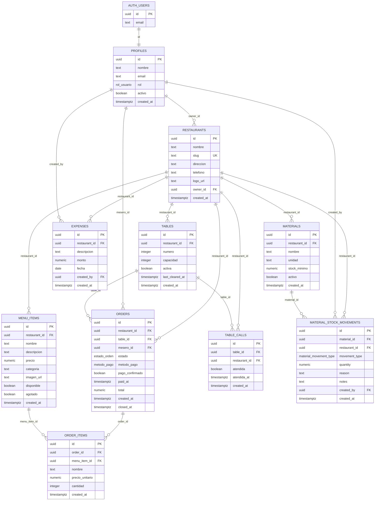

# ERD iComanda en Mermaid

Copia este bloque en Mermaid Live Editor, Excalidraw, draw.io o una herramienta compatible. Exporta la imagen como PNG y reemplaza `report/img/erd_database.png`.

## Enums

- `rol_usuario`: `mesero`, `admin`, `chef`
- `estado_orden`: `activa`, `lista`, `entregada`, `cancelada`
- `metodo_pago`: `efectivo`, `qr`, `tarjeta`
- `material_movement_type`: `consumo`, `reposicion`
